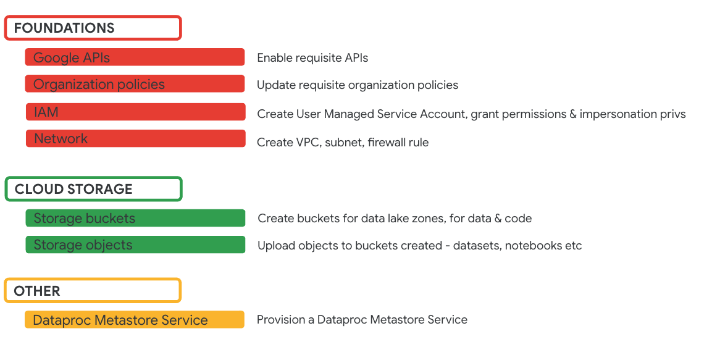
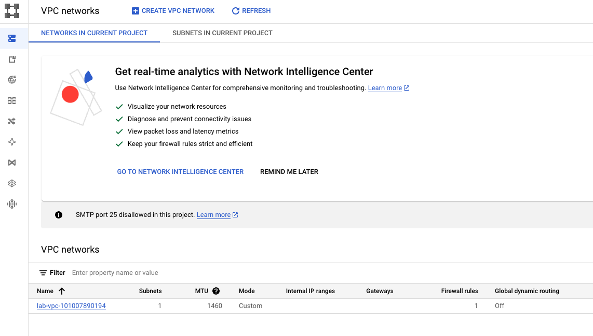
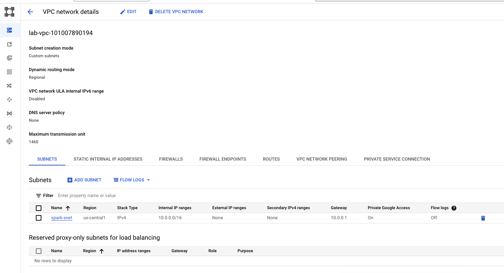

# BYO Jupyter infrastructure with Dataproc for Spark compute

## A. About the lab

### A.1. Abstract
This lab demonstrates how to use the Dataproc Jupyter plugin for bring your own Jupyter infrastructure with Dataproc Spark on GCE or Dataproc Spark Serverless with a minimum viable sample.

<br>

<hr>

### A.2. Duration 
It takes ~1 hour to complete and is fully scrpited, including with Terraform for provisioning.


<hr>

### A.3. Resources provisioned

   
<br><br>


<hr>

### A.4. Prerequisites

- A pre-created project
- You need to have organization admin rights, and project owner privileges or work with privileged users to complete provisioning.


<hr>

### A.5. Lab format

- Includes Terraform for provisioning automation
- Is fully scripted - the entire solution is provided, and with instructions
- Is self-paced/self-service


<hr>

### A.6. Audience

- A quick read for architects
- Targeted for hands on practitioners, especially data scientists and data engineers

<hr>

### A.7. Features covered

| Functionality | Feature | 
| -- | :--- | 
| ...|  ... |


<hr>


### A.8. Lab Flow

   
<br><br>

<hr>

# B. THE LAB

<hr>

## B.1. Infrastructure provisioning

### B.1.1. Clone this repo in Cloud Shell

```
cd ~
git clone https://github.com/anagha-google/dataproc-labs.git
```

<hr>

### B.1.2. Foundational provisioning automation with Terraform 
The Terraform in this section updates organization policies and enables Google APIs.<br>

1. Configure preferences by running this in Cloud Shell
```
cd ~/dataproc-labs/7-dataproc-jupyter-plugin/provisioning-automation/foundations-tf
chmod +x configure-preferences.sh 
./configure-preferences.sh
```

2. Run the Terraform for organization policy edits and enabling Google APIs
```
terraform init
terraform apply \
  -auto-approve >> dataproc-jupyter-plugin-foundations-tf.output
```

**Note:** Wait till the provisioning completes (~5 minutes or less) before moving to the next section.

<hr>

### B.1.3. Lab resources provisioning automation with Terraform 

#### B.1.3.1. Resources provisioned
In this section, we will provision-
1. Network, subnet, firewall rule
2. Storage buckets for code/data/logs 
3. Dataproc on GCE cluster
4. User Managed Service Account
5. Requisite IAM permissions
6. Copy of code, data, etc into buckets


#### B.1.3.2. Run the terraform scripts

1. Paste this in Cloud Shell after editing the GCP region variable to match your nearest region-

```
cd ~/dataproc-labs/7-dataproc-jupyter-plugin/provisioning-automation/core-tf/terraform

chmod +x configure-preferences.sh 
./configure-preferences.sh
```

2. Run the Terraform for provisioning the rest of the environment
```
terraform init
terraform apply \
  -auto-approve >> dataproc-jupyter-plugin-core-tf.output
```

**Note:** Takes ~10 minutes to complete.

<br>

<hr>

### B.2. Explore the resources provisioned

The following are screenshots from the author's environment-

#### B2.1. Networking

   
<br><br>

   
<br><br>

   
<br><br>

#### B2.2. Storage

   
<br><br>

   
<br><br>


   
<br><br>


   
<br><br>

#### B2.3. Dataproc on GCE cluster

   
<br><br>


#### B2.4. Dataproc Metastore Service

   
<br><br>

<hr>


<br>

<hr>


